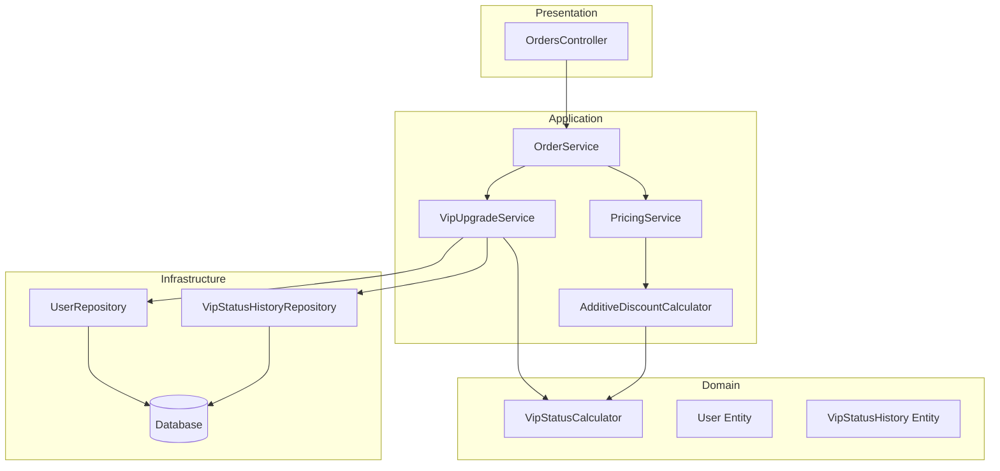

# Design Document: VIP Tier System

## Overview

This design enhances the existing VIP system to support a complete 4-tier customer loyalty program. The system will automatically calculate and update customer VIP tiers based on total spending, apply tier-specific discounts, and maintain a comprehensive audit trail of all tier changes.

The implementation modifies existing services (`VipStatusCalculator`, `VipUpgradeService`, `AdditiveDiscountCalculator`) rather than creating new ones, ensuring backward compatibility while adding the new tier functionality.

## Architecture



## Components and Interfaces

### IVipStatusCalculator (Enhanced)

The existing interface will be extended to support tier calculation:

```csharp
public interface IVipStatusCalculator
{
    int CalculateTier(decimal totalSpending);
    int GetDiscountPercentForTier(int tier);
    bool ShouldBeVip(decimal totalPaidAmount, bool currentVipStatus);
    VipStatusChange CalculateStatusChange(User user, decimal newTotalAmount);
}
```

### VipStatusCalculator (Enhanced Implementation)

```csharp
public class VipStatusCalculator : IVipStatusCalculator
{
    // Tier thresholds
    private const decimal Tier1Threshold = 1000m;
    private const decimal Tier2Threshold = 5000m;
    private const decimal Tier3Threshold = 30000m;
    
    // Tier discounts
    private const int Tier1Discount = 10;
    private const int Tier2Discount = 15;
    private const int Tier3Discount = 20;
    
    public int CalculateTier(decimal totalSpending)
    {
        if (totalSpending >= Tier3Threshold) return 3;
        if (totalSpending >= Tier2Threshold) return 2;
        if (totalSpending >= Tier1Threshold) return 1;
        return 0;
    }
    
    public int GetDiscountPercentForTier(int tier)
    {
        return tier switch
        {
            1 => Tier1Discount,
            2 => Tier2Discount,
            3 => Tier3Discount,
            _ => 0
        };
    }
}
```

### VipUpgradeService (Enhanced)

The service will be updated to:
1. Calculate tier based on total spending
2. Support multi-tier jumps (e.g., 0 → 3)
3. Support tier downgrades on order cancellation
4. Create VipStatusHistory records for all tier changes

```csharp
public async Task CheckAndUpgradeAsync(Guid userId, decimal? orderTotal = null)
{
    var user = await _userRepository.GetByIdAsync(userId);
    var totalPaidAmount = await _orderRepository.GetTotalPaidAmountForUserAsync(userId);
    
    var previousTier = user.VipTier;
    var newTier = _vipStatusCalculator.CalculateTier(totalPaidAmount);
    
    if (previousTier != newTier)
    {
        // Update user
        user.VipTier = newTier;
        user.IsVip = newTier > 0;
        user.TotalSpending = totalPaidAmount;
        user.VipUpgradedAt = newTier > previousTier ? DateTime.UtcNow : user.VipUpgradedAt;
        
        // Create history record
        var history = new VipStatusHistory
        {
            UserId = userId,
            PreviousTier = previousTier,
            NewTier = newTier,
            TriggeringOrderTotal = orderTotal ?? 0m,
            TotalSpendingAtUpgrade = totalPaidAmount,
            Reason = BuildReason(previousTier, newTier, totalPaidAmount)
        };
        
        await _vipStatusHistoryRepository.AddAsync(history);
        await _userRepository.UpdateAsync(user);
    }
}
```

### AdditiveDiscountCalculator (Enhanced)

The calculator will be updated to use tier-based discounts:

```csharp
public class AdditiveDiscountCalculator : IDiscountCalculator
{
    private readonly IVipStatusCalculator _vipStatusCalculator;
    
    public DiscountBreakdown GetDiscountBreakdown(decimal basePrice, decimal productDiscountPercent, int vipTier)
    {
        var vipDiscountPercent = _vipStatusCalculator.GetDiscountPercentForTier(vipTier);
        
        var productDiscountAmount = basePrice * (productDiscountPercent / 100m);
        var vipDiscountAmount = basePrice * (vipDiscountPercent / 100m);
        var totalDiscountAmount = Math.Min(productDiscountAmount + vipDiscountAmount, basePrice);
        var finalPrice = Math.Round(basePrice - totalDiscountAmount, 2);
        
        return new DiscountBreakdown { /* ... */ };
    }
}
```

## Data Models

### User Entity (Existing - No Changes Required)

The existing User entity already supports the required fields:
- `VipTier` (int): 0-3 for tier levels
- `IsVip` (bool): true if tier > 0
- `TotalSpending` (decimal): cumulative spending
- `VipUpgradedAt` (DateTime?): last upgrade timestamp

### VipStatusHistory Entity (Existing - Validation Update)

The existing entity needs validation updates to support multi-tier jumps:

```csharp
public class VipStatusHistory : BaseEntity
{
    public Guid UserId { get; set; }
    public int PreviousTier { get; set; }  // 0-3
    public int NewTier { get; set; }       // 0-3
    public decimal TriggeringOrderTotal { get; set; }
    public decimal TotalSpendingAtUpgrade { get; set; }
    public string Reason { get; set; }
    
    public override void ValidateEntity()
    {
        // Remove restriction: "Users can only upgrade from regular (0) to VIP tier 1"
        // Allow any tier transition (upgrade or downgrade)
        if (PreviousTier == NewTier)
            throw new InvalidOperationException("VIP tier must change");
    }
}
```

### Tier Configuration

| Tier | Name | Min Spending | Max Spending | Discount |
|------|------|--------------|--------------|----------|
| 0 | Normal | 0 | 999.99 | 0% |
| 1 | VIP Tier 1 | 1,000 | 4,999.99 | 10% |
| 2 | VIP Tier 2 | 5,000 | 29,999.99 | 15% |
| 3 | VIP Tier 3 | 30,000 | ∞ | 20% |

## Correctness Properties

*A property is a characteristic or behavior that should hold true across all valid executions of a system—essentially, a formal statement about what the system should do. Properties serve as the bridge between human-readable specifications and machine-verifiable correctness guarantees.*

### Property 1: Tier Calculation Correctness

*For any* total spending amount, the calculated VIP tier SHALL match the defined threshold rules:
- spending < 1000 → Tier 0
- 1000 ≤ spending < 5000 → Tier 1
- 5000 ≤ spending < 30000 → Tier 2
- spending ≥ 30000 → Tier 3

**Validates: Requirements 1.1, 1.2, 1.3, 1.4, 4.1, 4.4**

### Property 2: Tier-to-Discount Mapping

*For any* VIP tier, the discount percentage SHALL be:
- Tier 0 → 0%
- Tier 1 → 10%
- Tier 2 → 15%
- Tier 3 → 20%

**Validates: Requirements 2.1, 2.2, 2.3, 2.4**

### Property 3: Additive Discount Calculation

*For any* base price, product discount, and VIP tier, the final price SHALL equal:
`basePrice - (basePrice × productDiscount%) - (basePrice × vipDiscount%)`
with the total discount capped at 100% of base price.

**Validates: Requirements 2.5, 5.2**

### Property 4: History Record Completeness

*For any* tier change operation, a VipStatusHistory record SHALL be created containing:
- Previous tier (valid 0-3)
- New tier (valid 0-3, different from previous)
- Triggering order total (≥ 0)
- Total spending at upgrade (≥ 0)
- Non-empty reason string

**Validates: Requirements 3.1, 3.2**

### Property 5: Tier Transition Correctness

*For any* spending change (increase or decrease), the tier SHALL be recalculated correctly:
- Upgrades: new tier > previous tier when spending crosses threshold upward
- Downgrades: new tier < previous tier when spending crosses threshold downward
- Multi-tier jumps are supported (e.g., 0 → 3 when spending jumps to 30000+)

**Validates: Requirements 4.2, 4.3**

### Property 6: Price Rounding and Audit Trail

*For any* discount calculation:
- Final price SHALL be rounded to exactly 2 decimal places
- The applied VIP discount percentage SHALL be stored on the order item

**Validates: Requirements 5.1, 5.3**

## Error Handling

| Scenario | Handling |
|----------|----------|
| User not found | Throw `UserNotFoundException` |
| Invalid tier value (< 0 or > 3) | Throw `ArgumentException` |
| Negative spending amount | Throw `ArgumentException` |
| Database save failure | Throw exception, rollback transaction |
| Concurrent tier update | Use optimistic concurrency, retry on conflict |

## Testing Strategy

### Unit Tests

Unit tests will verify specific examples and edge cases:
- Tier boundary values (999.99, 1000, 4999.99, 5000, 29999.99, 30000)
- Discount calculation with various product discount combinations
- History record creation with valid data
- Error conditions (invalid inputs, missing users)

### Property-Based Tests

Property-based tests will use **FsCheck** (C# property-based testing library) to verify universal properties:

1. **Tier Calculation Property**: Generate random spending amounts (0 to 100000), verify correct tier assignment
2. **Discount Mapping Property**: Generate random tiers (0-3), verify correct discount percentage
3. **Additive Discount Property**: Generate random (basePrice, productDiscount, tier) tuples, verify calculation
4. **History Completeness Property**: Generate random tier changes, verify all fields populated
5. **Tier Transition Property**: Generate random spending sequences, verify tier transitions

Configuration:
- Minimum 100 iterations per property test
- Each test tagged with: **Feature: vip-tier-system, Property N: [description]**

### Integration Tests

Integration tests will verify:
- End-to-end order flow with tier upgrades
- VipStatusHistory persistence
- Concurrent tier update handling
